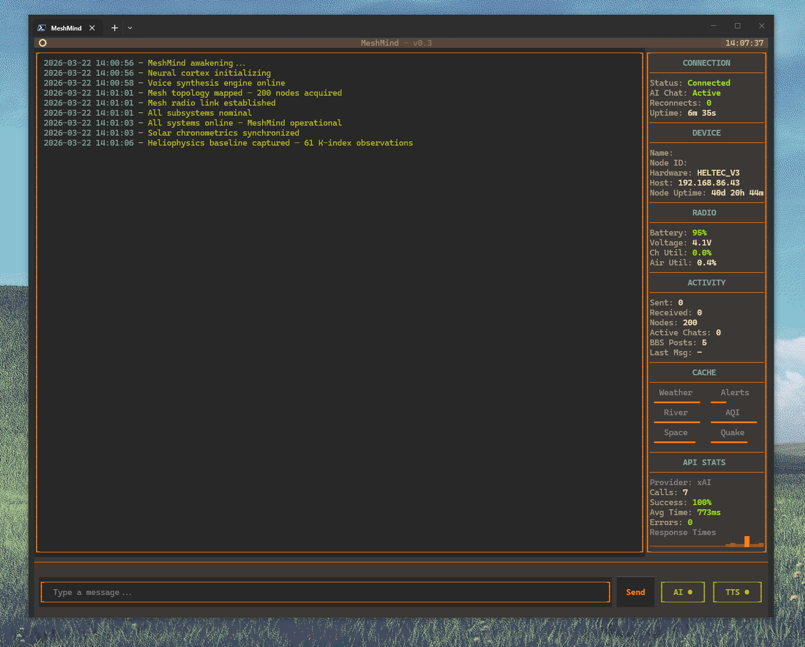

# MeshMind

An AI-powered Meshtastic bot with a terminal dashboard, built in Python.

MeshMind connects to a Meshtastic LoRa mesh network and provides AI chat, weather forecasts, NOAA alerts, river level monitoring, air quality reports, earthquake alerts, space weather warnings, and more. All managed through a rich terminal UI.

## About

MeshMind runs as a background service that listens on a Meshtastic mesh channel and responds to user commands and free-form chat messages. It pairs an OpenAI-compatible AI backend with real-time data from NOAA, USGS, Tomorrow.io, Sunrise-Sunset, AirNow, and NOAA SWPC APIs to deliver useful information over the mesh.

The terminal interface gives you a live dashboard with a scrolling log viewer, a status panel showing connection health, device telemetry, API stats, and cache state, plus an input bar for sending manual messages.

### What it does

**Mesh commands** — users on the mesh can send these:

| Command           | Response                               |
| ----------------- | -------------------------------------- |
| `ping`            | PONG with SNR/RSSI signal metrics      |
| `wx`              | Next 6 hours hourly forecast           |
| `river`           | River level from USGS gauge            |
| `aqi`             | Current Air Quality Index              |
| `bbspost <msg>`   | Post a message to the shared board     |
| `bbsread`         | Read all current board messages (DM)   |
| `uptime`          | Bot uptime since last restart          |
| `api`             | API call stats (total, rate, avg time) |
| `help`            | Lists all available commands           |
| *(anything else)* | AI chat response                       |

**Automated broadcasts** — the bot sends these on its own schedule:

- Weather condition updates on a configurable interval (default: every 3 hours)
- NOAA severe weather alerts (with exponential backoff on API failures)
- Sunrise and sunset notifications with forecast, daylight hours, and moon phase
- Frost warnings (seasonal, Mar-May / Sep-Nov)
- Flood warnings (when river monitoring is enabled)
- Air quality alerts when AQI level escalates (when AQI monitoring is enabled)
- Space weather alerts for geomagnetic storms, aurora visibility, and GPS/radio disruption (Kp ≥ 5)
- Earthquake alerts for nearby seismic events above a configurable magnitude threshold

**BBS (bulletin board)** — a lightweight shared message board for the mesh. Users post short messages with `bbspost` and read them back with `bbsread`. The board holds up to 5 posts; older ones are dropped when full. Posts expire automatically after 7 days. The board persists across restarts. Enabled by default, can be disabled with `bbs_enabled: false`.

**AI chat** — non-command messages are forwarded to an OpenAI-compatible API. On every call, a live snapshot of cached weather conditions, active NOAA alerts, river level, and AQI is injected into the system prompt, giving the AI ambient awareness of current conditions — it can answer "is it cold out?" or "how's the river?" without needing explicit commands. The bot maintains per-user conversation history with configurable depth (`max_chat_history`) and inactivity timeout (`chat_timeout_minutes`). AI responses can be paused without affecting commands or broadcasts. Long responses are automatically split across multiple messages. When using xAI/Grok, optional web search can be enabled (`ai_search_enabled`) to let the AI answer questions about news and current events using live web results.

**Resilience** — automatic reconnection to the Meshtastic device with retry logic, post-reconnect stabilization delay, duplicate broadcast prevention, and exponential backoff on external API failures. On startup, the bot retries the initial connection up to 5 times with increasing delays.

**Logging** — all activity is written to `logs/meshmind.log` (rotating, 5 MB per file, up to 5 files / 25 MB total). Log files persist after the TUI closes.

### TUI dashboard



The terminal interface is split into two panels:

- **Log viewer** (left) — color-coded, theme-aware log output with automatic text reflow on resize
- **Status panel** (right) — live-updating dashboard with sections for connection, device info, radio telemetry (battery, channel/air utilization), API stats with sparkline, cache freshness bars, and message activity

All app functions are accessible through the command palette (`Ctrl+P`): quit, clear logs, reconnect, change theme, toggle AI chat, toggle TTS, and select TTS voice.

### Text-to-speech

Incoming mesh messages can be read aloud using [kokoro-onnx](https://github.com/thewh1teagle/kokoro-onnx) for local neural TTS. Voice selection and TTS toggle are available from the input bar and command palette.

TTS dependencies (`kokoro-onnx`, `sounddevice`) are installed automatically when TTS is first enabled. Model files (~337 MB) are also downloaded on first use.

## Setup

### Requirements

- Python 3.10+
- A Meshtastic device accessible over TCP (e.g. a device on your local network)

### Install dependencies

```
pip install -r requirements.txt
```

### Configuration

Copy the example files and edit them:

```
cp settings.example.json settings.json
cp .env.example .env
```

**`settings.json`** — all bot settings:

| Setting                    | Description                                                                    | Default                 |
| -------------------------- | ------------------------------------------------------------------------------ | ----------------------- |
| `device_host`              | Meshtastic device IP address                                                   | `""`                    |
| `mesh_channel`             | Meshtastic channel index                                                       | `0`                     |
| `bot_name`                 | Bot display name on the mesh                                                   | `"MeshBot"`             |
| `location_name`            | Location for weather/context                                                   | `""`                    |
| `lat` / `lon`              | Coordinates for weather APIs                                                   | `0.0`                   |
| `timezone`                 | IANA timezone (e.g. `America/New_York`)                                        | auto-derived            |
| `noaa_zone`                | NOAA forecast zone — [find yours here](https://www.weather.gov/pimar/PubZone)  | auto-derived            |
| `ai_base_url`              | OpenAI-compatible API endpoint                                                 | `"https://api.x.ai/v1"` |
| `ai_model`                 | AI model name                                                                  | `"grok-3-mini"`         |
| `ai_temperature`           | AI response temperature (0.0–2.0)                                              | `1.0`                   |
| `ai_provider`              | AI provider type: `"cloud"`, `"ollama"`, or `"lmstudio"`                       | `"cloud"`               |
| `ai_search_enabled`        | Enable AI web search (xAI/Grok only)                                           | `false`                 |
| `bbs_enabled`              | Enable the shared BBS message board                                            | `true`                  |
| `river_enabled`            | Enable USGS river monitoring                                                   | `false`                 |
| `river_gauge_id`           | USGS gauge site number — [find yours here](https://waterdata.usgs.gov/nwis/rt) | `""`                    |
| `river_name`               | Display name for the river                                                     | `""`                    |
| `flood_stages`             | Flood stage thresholds (ft)                                                    | `{"action": 0, ...}`    |
| `theme`                    | TUI color theme                                                                | `"tokyo-night"`         |
| `tts_enabled`              | Enable text-to-speech on start                                                 | `false`                 |
| `tts_voice`                | TTS voice name (kokoro-onnx)                                                   | `"af_heart"`            |
| `aqi_enabled`              | Enable air quality monitoring ([AirNow](https://www.airnowapi.org/))           | `false`                 |
| `aqi_distance_miles`       | Search radius for AQI monitoring stations                                      | `25`                    |
| `space_weather_enabled`    | Enable geomagnetic storm alerts ([NOAA SWPC](https://www.swpc.noaa.gov/))      | `false`                 |
| `earthquake_enabled`       | Enable USGS earthquake alerts                                                  | `false`                 |
| `earthquake_min_magnitude` | Minimum magnitude to trigger an alert                                          | `4.0`                   |
| `earthquake_radius_km`     | Search radius from your location (km)                                          | `500`                   |
| `conditions_update_interval_hours` | How often to broadcast current weather conditions                    | `3`                     |
| `alert_check_interval_seconds`     | How often to poll NOAA for active weather alerts                     | `600`                   |
| `health_check_interval_hours`      | How often to send a bot health/status broadcast                      | `6`                     |
| `chat_timeout_minutes`             | Inactivity before a user's conversation history resets               | `30`                    |
| `max_chat_history`                 | Max messages kept per user in conversation memory                    | `50`                    |
| `frost_temp_threshold`             | Temperature (°F) at or below which a frost warning triggers          | `32`                    |

If `timezone` or `noaa_zone` are left empty, the bot will auto-derive them from lat/lon using the NOAA API on startup.

**`.env`** — API keys

| Variable              | Required | Purpose                                                                |
| --------------------- | -------- | ---------------------------------------------------------------------- |
| `AI_API_KEY`          | Yes      | API key for the AI provider (xAI, OpenAI, OpenRouter, Groq, etc.)      |
| `TOMORROW_IO_API_KEY` | No       | Tomorrow.io weather API key (falls back to NOAA if not set)            |
| `AIRNOW_API_KEY`      | No       | [AirNow](https://www.airnowapi.org/) API key for AQI monitoring (free) |

### Run

```
python meshmind.py
```

## Themes

MeshMind ships with 13 themes, switchable from the command palette:

Tokyo Night, Nord, Gruvbox, Solarized Dark, Catppuccin Mocha, Dracula, Rose Pine, Osaka Jade, Synthwave 84, One Dark, Monokai, Material Ocean, Kanagawa

## MeshMon

MeshMon is a standalone service status monitor TUI that tracks the health of every API endpoint MeshMind depends on. It runs independently from the bot — no Meshtastic device or `.env` keys required — and gives you a live overview of NOAA Weather, NOAA Alerts, USGS Earthquakes, USGS River Gauge, Space Weather, Sunrise-Sunset, Tomorrow.io, AirNow, and MQTT broker connectivity.

### Features

- **Service table** — live HTTP status, response time, and health indicator for each endpoint
- **Overview panel** — at-a-glance count of healthy / degraded / down services
- **MQTT panel** — real-time Meshtastic MQTT traffic monitor
- **Themes** — shares the same theme engine as MeshMind
- **Auto-configuration** — on first run, imports location settings from your MeshMind `settings.json`

### Run

```
pip install -r meshmon/requirements.txt   # if not already installed
python meshmon.py
```

### Configuration

MeshMon uses its own settings file at `meshmon/settings.json`, auto-created on first launch from `meshmon/settings.example.json` defaults (with location pulled from the parent MeshMind settings if available).

| Setting                  | Description                                     | Default                  |
| ------------------------ | ----------------------------------------------- | ------------------------ |
| `theme`                  | Color theme                                     | `"tokyo-night"`          |
| `check_interval`         | Seconds between service checks                  | `60`                     |
| `http_timeout`           | HTTP request timeout (seconds)                  | `10`                     |
| `degraded_threshold`     | Response time (seconds) to mark service degraded | `3.0`                   |
| `lat` / `lon`            | Coordinates for location-based APIs             | `0.0`                    |
| `noaa_zone`              | NOAA forecast zone                              | `""`                     |
| `river_gauge_id`         | USGS gauge site number                          | `""`                     |
| `aqi_distance_miles`     | Search radius for AQI stations                  | `25`                     |
| `earthquake_min_magnitude` | Minimum magnitude for earthquake endpoint     | `4.0`                    |
| `earthquake_radius_km`   | Search radius from your location (km)           | `500`                    |
| `mqtt_enabled`           | Enable MQTT broker monitoring                   | `true`                   |
| `mqtt_broker`            | MQTT broker hostname                            | `"mqtt.meshtastic.org"`  |
| `mqtt_port`              | MQTT broker port                                | `1883`                   |
| `mqtt_topic`             | MQTT topic filter                               | `"msh/#"`                |

## Built with

| Project                                                    | Role                         |
| ---------------------------------------------------------- | ---------------------------- |
| [Meshtastic](https://github.com/meshtastic/python)         | LoRa mesh network interface  |
| [Textual](https://github.com/Textualize/textual)           | Terminal UI framework        |
| [OpenAI Python](https://github.com/openai/openai-python)   | AI chat (any compatible API) |
| [kokoro-onnx](https://github.com/thewh1teagle/kokoro-onnx) | Local neural text-to-speech  |
| [PyPubSub](https://github.com/schollii/pypubsub)           | Meshtastic event pub/sub     |

**APIs:** [NOAA Weather](https://www.weather.gov/documentation/services-web-api), [USGS Water Services](https://waterservices.usgs.gov/), [Tomorrow.io](https://www.tomorrow.io/), [Sunrise-Sunset](https://sunrise-sunset.org/api), [AirNow](https://www.airnowapi.org/), [NOAA SWPC](https://www.swpc.noaa.gov/), [USGS Earthquake Hazards](https://earthquake.usgs.gov/fdsnws/event/1/)

## License

MIT — see [LICENSE](LICENSE) for details.

## Project structure

```
assets/                  # Screenshots and images
meshmind.py              # MeshMind entry point
meshmon.py               # MeshMon entry point
system_prompt.txt        # AI system prompt template
settings.json            # User configuration (generated)
requirements.txt         # Python dependencies
logs/                    # Rotating log files (auto-created)
meshmind/
  app.py                 # Textual app, command palette, worker management
  bot.py                 # Meshtastic bot logic, commands, APIs, scheduling
  config.py              # Configuration dataclass, settings loader
  tts.py                 # Text-to-speech engine (kokoro-onnx)
  themes/
    definitions.py       # Theme color palettes (13 themes)
    styles.tcss           # Textual CSS layout
  widgets/
    log_viewer.py        # Scrolling log panel with reflow
    status_panel.py      # Live dashboard panel
    message_input.py     # Input bar with Send/AI/TTS controls
    theme_picker.py      # Theme selection modal
    voice_picker.py      # TTS voice selection modal
  utils/
    settings.py          # JSON settings persistence
    bbs.py               # BBS board logic and persistence
meshmon/
  app.py                 # Textual app, theme management, engine worker
  config.py              # Settings persistence, service list builder
  settings.example.json  # Example configuration
  requirements.txt       # MeshMon-specific dependencies
  monitors/
    engine.py            # Background monitor engine
    http_monitor.py      # HTTP endpoint health checker
    mqtt_monitor.py      # MQTT broker connectivity monitor
  styles/
    meshmon.tcss         # Textual CSS layout
  themes/                # Shared theme definitions
  widgets/
    overview_panel.py    # Service health summary
    service_table.py     # Live service status table
    mqtt_panel.py        # MQTT traffic panel
    theme_picker.py      # Theme selection modal
```
